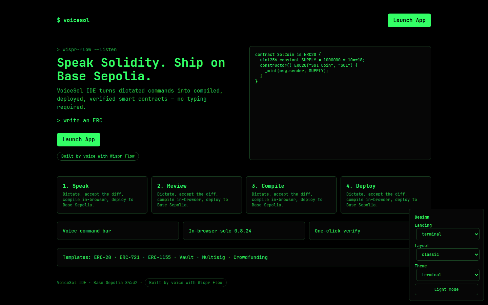
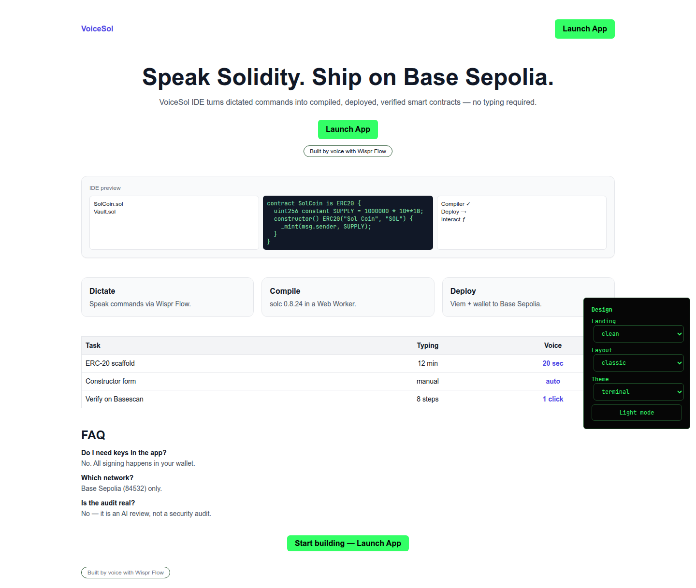
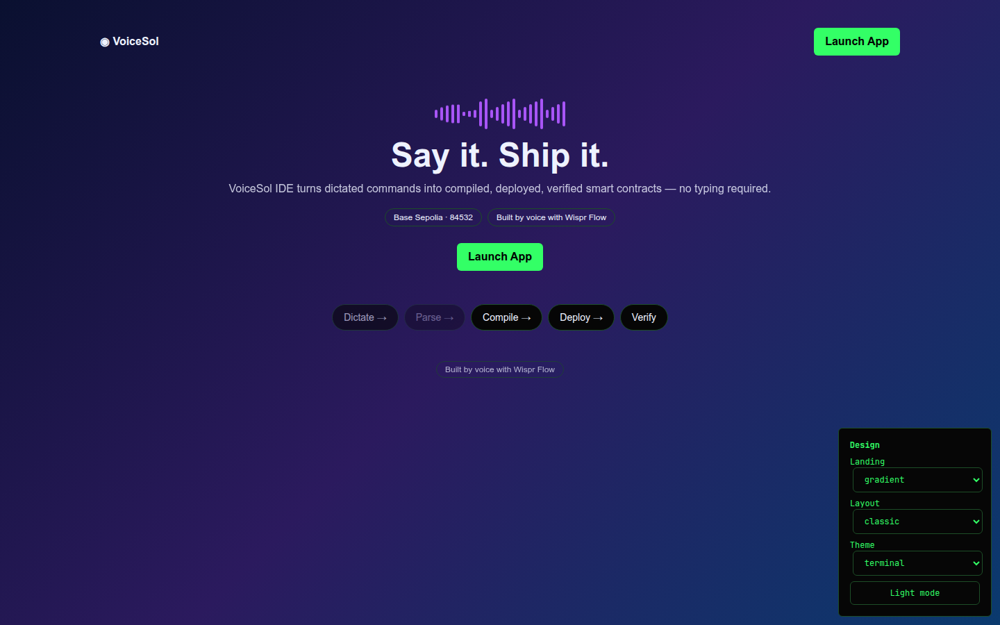
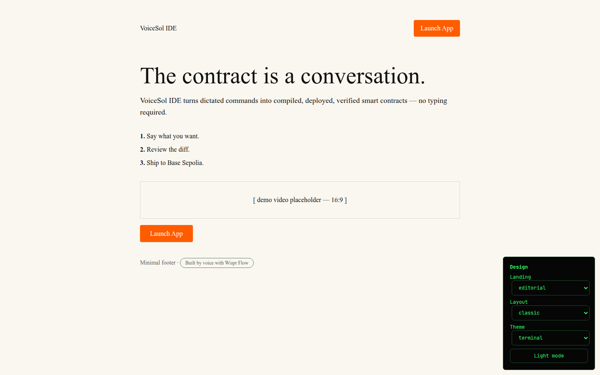
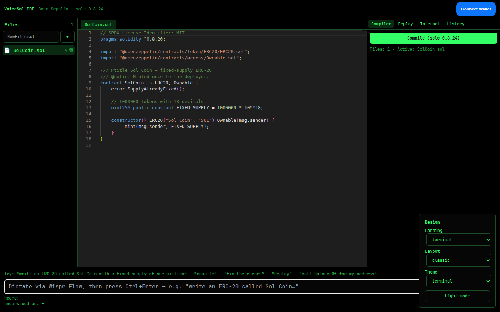
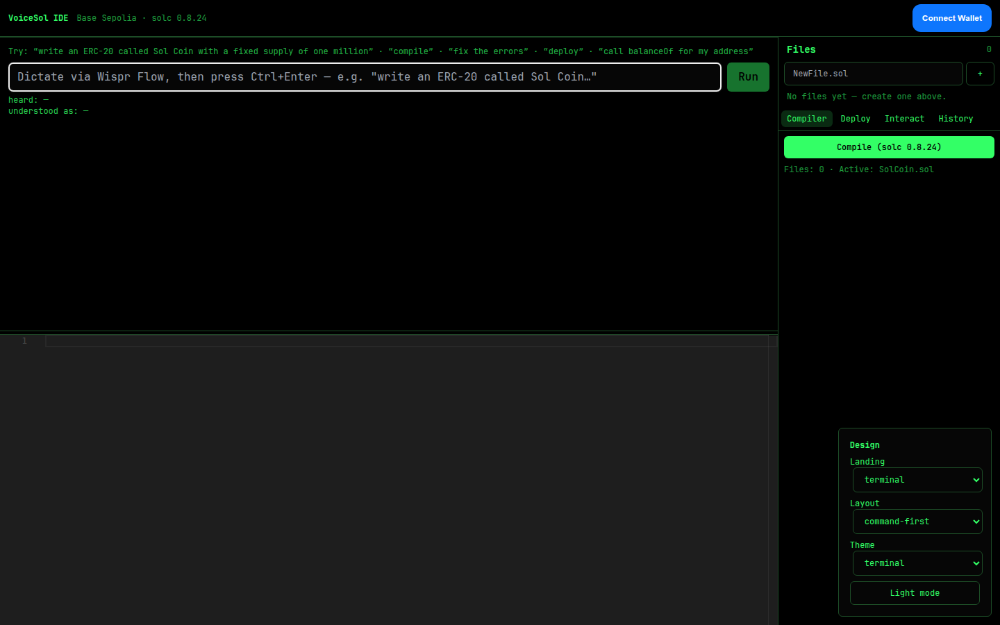
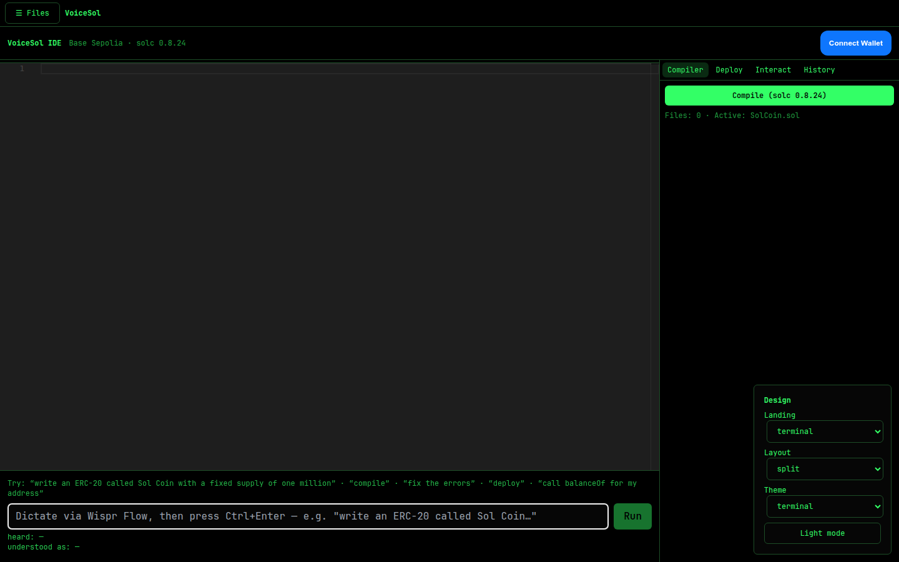
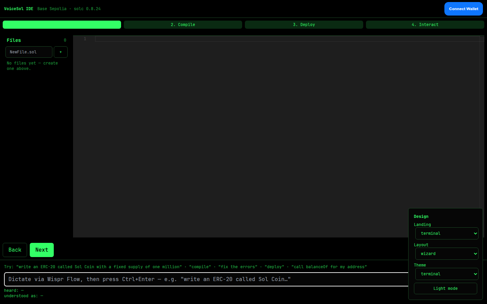

# VoiceSol IDE

Speak Solidity, ship on Base Sepolia. Dictate commands (via Wispr Flow) into the command bar: write → review diff → compile (solc 0.8.24 in a Web Worker) → deploy (wallet signs) → verify → interact.

## Setup

```bash
npm install
cp .env.example .env   # fill in keys
npm run dev            # http://localhost:3000 (landing), /app (IDE), /showcase
npm test               # vitest (32 tests)
npx playwright test    # 16 screenshot tests + browser compile test → /screenshots
npm run build
```

## Env vars

| Var | Purpose |
|---|---|
| `ANTHROPIC_API_KEY` | Claude intent parsing + explain/audit/fix (server-side only) |
| `NEXT_PUBLIC_WALLETCONNECT_PROJECT_ID` | RainbowKit wallet connect |
| `ETHERSCAN_API_KEY` | Basescan/Etherscan V2 verification (server-side only) |
| `NEXT_PUBLIC_CHAIN_ID` | 84532 (Base Sepolia) |
| `NEXT_PUBLIC_RPC_URL` | https://sepolia.base.org |
| `NEXT_PUBLIC_EXPLORER_URL` | https://sepolia.basescan.org |
| `NEXT_PUBLIC_SOLC_VERSION` | 0.8.24 |
| `NEXT_PUBLIC_ANTHROPIC_MODEL` | claude-3-5-sonnet-20240620 |

Without `ANTHROPIC_API_KEY`, the parse route uses a local keyword fallback.

## Testnet ETH

1. Connect wallet in the IDE (must be Base Sepolia, chain 84532).
2. If balance is zero, the banner links to the Base Sepolia faucet.
3. Deploy — the wallet signs via viem; no private keys ever touch the app.

## Flow diagram

```
dictate (Wispr Flow) → command bar → /api/parse (Claude JSON + Zod)
  → write/edit: diff modal → Accept/Reject (undo stack 20/file)
  → compile: Web Worker solc 0.8.24 + OZ jsDelivr imports + IndexedDB cache
  → deploy: constructor form → wallet signs → receipt → Basescan link
  → verify: /api/verify (Etherscan V2, chain 84532) → poll status
  → interact: ABI forms (view calls run, writes confirm first)
```

## Screenshots

Landing variants (1440px) — mobile 375px versions alongside in [`/screenshots`](./screenshots):

| terminal (`/?landing=terminal`) | clean (`/?landing=clean`) |
|---|---|
|  |  |

| gradient (`/?landing=gradient`) | editorial (`/?landing=editorial`) |
|---|---|
|  |  |

IDE layouts (1440px) — each also captured at 375px in [`/screenshots`](./screenshots).
Under 1100px wide the IDE falls back to the split layout.

| classic (`/app?layout=classic`) | command-first (`/app?layout=command-first`) |
|---|---|
|  |  |

| split (`/app?layout=split`) | wizard (`/app?layout=wizard`) |
|---|---|
|  |  |

Regenerate with `npx playwright test tests/e2e/shots.spec.ts` (uses system Chrome).

## Troubleshooting compile errors

- `factory is not a function` → the worker failed to load solc from the CDN
  (fixed: `soljson.js` is loaded via `importScripts`, not ESM import).
  Check the browser is online — solc and OpenZeppelin sources come from jsDelivr.
- `Source "@openzeppelin/..." not found` / `File not supplied initially` →
  a transitive OZ import didn't resolve (fixed: relative imports inside the
  OZ tree resolve against the pinned CDN). If offline, previously cached
  sources in IndexedDB still work.
- Anything else → open the Compiler tab for severity + file:line:column,
  click an error to jump to the line, or dictate "fix the errors".

## Known limits

- Spoken hex addresses are never accepted — paste into a validated field instead.
- OZ imports need network on first fetch (then cached in IndexedDB).
- `fix_errors` stops after 3 automatic attempts.
- Audit output is an AI review, not a security audit.
- Deployment restricted to chain 84532; other chains are refused.
- Bytecode over 24 KB warns (EIP-170).

## Demo script

1. Dictate: "write an ERC-20 called Sol Coin with a fixed supply of one million" → Accept the diff.
2. "compile" → clean result, ABI + bytecode size shown.
3. Break something (e.g. delete a semicolon) → "fix the errors" → Accept → recompile.
4. "deploy" → fill constructor form → confirm in wallet → Basescan link.
5. Verify from the Deploy tab → "Verified".
6. Interact tab → call `balanceOf` with "my address".
7. "undo" reverts; Esc cancels a pending diff; Ctrl+Enter runs the bar; Ctrl+S saves.

## Variants

- Landing: `/?landing=terminal|clean|gradient|editorial`
- IDE layout: `/app?layout=classic|command-first|split|wizard`
- Floating **Design** menu (demo mode) switches instantly; choice persists in localStorage.
- `/showcase` grid links every combination. Playwright screenshots → `/screenshots`.
